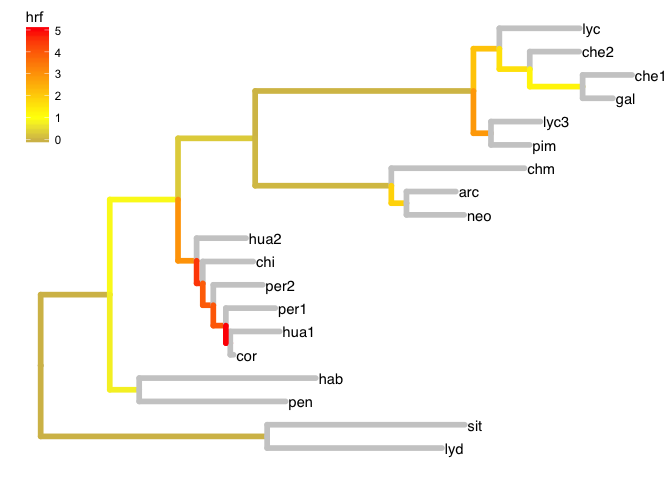

<!-- README.md is generated from README.Rmd. Please edit that file -->
The P(e):P(o) package
=====================

This is the alpha release of `pepo`, an R package to calculate the hemiplasy risk factor (HRF) on a phylogeny. This packages depends on `ape`, `dplyr`, and `purrr`. The last two are part of the `tidyverse` package (loaded below).

Installation
------------

Install `pepo` from github with: `devtools::install_github("guerreror/pepo")`.

``` r
library(tidyverse)
library(pepo)
```

In this example, we start with a preloaded phylogeny of Solanum sect Lycopersicon from Pease et al (2016). The tree is already of class `phylo` (from the 'ape' package).

``` r
data("tomato")
class(tomato)
#> [1] "phylo"
```

Minimal example
---------------

The two functions you'll need from `pepo` are: `prep_branch_lengths()` and `tree_hrf()`. The former returns a tibble (a `data_frame` from the tidyverse) with variables that will be needed by the latter.

``` r
tomato_branches <- prep_branch_lengths(tomato) 
tomato_branches
#> # A tibble: 36 x 7
#>     code  from    to this_branch descendants ancestor sibling
#>    <chr> <int> <int>       <dbl>      <list>    <dbl>   <dbl>
#>  1 20-21    20    21     1.39899   <dbl [2]>       NA 4.58565
#>  2 21-22    21    22     1.38205   <dbl [2]>  1.39899 0.59592
#>  3 22-23    22    23     1.56198   <dbl [2]>  1.38205 0.37641
#>  4 23-24    23    24     4.41939   <dbl [2]>  1.56198 2.75669
#>  5 24-25    24    25     0.52482   <dbl [2]>  4.41939 0.35540
#>  6 25-26    25    26     0.61579   <dbl [2]>  0.52482 1.62564
#>  7 26-27    26    27     1.07045   <dbl [2]>  0.61579 1.00000
#>  8  27-1    27     1     0.61217   <dbl [0]>  1.07045 1.00000
#>  9  27-2    27     2     1.00000   <dbl [0]>  1.07045 0.61217
#> 10  26-3    26     3     1.00000   <dbl [0]>  0.61579 1.07045
#> # ... with 26 more rows
```

Then we can call `tree_hrf()` on that tibble. The function will return the original data frame plus a new variable, `hrf`. This function assumes branch lengths are **in coalescent units** (e.g., calculated in MP-EST). The call below will assume the default population-wide mutation rate (0.01).

``` r
tomato_hrf <- tree_hrf(tomato_branches)
tomato_hrf
#> # A tibble: 36 x 8
#>     code  from    to this_branch descendants ancestor sibling        hrf
#>    <chr> <int> <int>       <dbl>      <list>    <dbl>   <dbl>      <dbl>
#>  1 20-21    20    21     1.39899   <dbl [2]>       NA 4.58565 0.00000000
#>  2 21-22    21    22     1.38205   <dbl [2]>  1.39899 0.59592 0.88732498
#>  3 22-23    22    23     1.56198   <dbl [2]>  1.38205 0.37641 0.31425475
#>  4 23-24    23    24     4.41939   <dbl [2]>  1.56198 2.75669 0.03509658
#>  5 24-25    24    25     0.52482   <dbl [2]>  4.41939 0.35540 2.14074113
#>  6 25-26    25    26     0.61579   <dbl [2]>  0.52482 1.62564 1.62443028
#>  7 26-27    26    27     1.07045   <dbl [2]>  0.61579 1.00000 1.25850011
#>  8  27-1    27     1     0.61217   <dbl [0]>  1.07045 1.00000         NA
#>  9  27-2    27     2     1.00000   <dbl [0]>  1.07045 0.61217         NA
#> 10  26-3    26     3     1.00000   <dbl [0]>  0.61579 1.07045         NA
#> # ... with 26 more rows
```

Some `NA` values in the `hrf` column are normal: the function does not calculate HRF for tips or ancestral branches. This is because the HRF is a property of a branch that has: 1) two descendant lineages, 2) a sister lineage, and 3) an ancestral branch with known length.

That's it. Now we can explore/plot the HRF of all branches in the phylogeny. For example, we can use the `ggtree` package to plot the tree. `pepo` includes the `to_treedata()` function to convert our data frame and `phylo` tree into a `ggtree`-compatible object.

``` r
library(ggtree)
solgg <- to_treedata(tomato, tomato_hrf)

ggtree(solgg, aes(color=hrf), size=2) + 
  geom_tiplab(color='black') +
  scale_color_gradient2(low = "darkblue", mid = "yellow", high="red", midpoint=1, na.value="grey80")+
  theme(legend.position = c(.05, .85))
```


