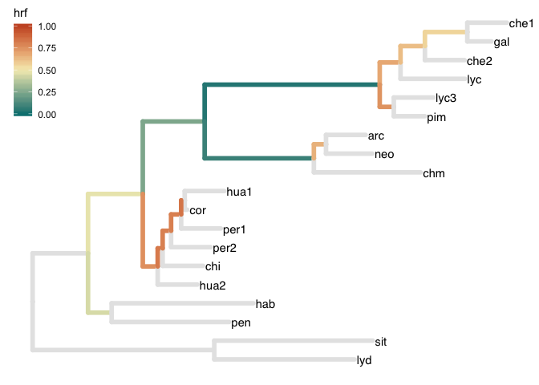

<!-- README.md is generated from README.Rmd. Please edit that file -->
The P(e):P(o) package
=====================

This is the beta release of `pepo`, a minimal package to calculate the probabilities of hemiplasy (trait evolution incongruent with species tree due to incomplete lineage sorting) and homoplasy (incongruent traits due to convergent mutations). Currently, the package includes functions to estimate the fraction of incongruency expected to be due to hemiplasy, which we call the Hemiplasy Risk Factor (HRF), for all branches on a phylogeny. Provided a tree, branch lengths and population-wide mutation rate in coalescent units (2N), the HRF will give an intuition for the relative importance of hemiplasy in the evolution of a particular clade.

Installation
------------

This package depends on `ape`, `dplyr`, and `purrr`. The last two are part of the `tidyverse`.

Install `pepo` from github with: `devtools::install_github("guerreror/pepo")`.

``` r
library(pepo)
library(tidyverse)
```

Quick example
-------------

In this example we start with a preloaded phylogeny of Solanum sect Lycopersicon from Pease et al (2016). The tree is already of class `phylo` (from the 'ape' package).

``` r
data("tomato")
class(tomato)
#> [1] "phylo"
```

The two functions you'll need from `pepo` are: `prep_branch_lengths()` and `tree_hrf()`. The former returns a tibble (a tidy data frame) with variables that will be needed by the latter.

``` r
tomato_branches <- prep_branch_lengths(tomato) 
tomato_branches
#> # A tibble: 36 x 7
#>    code   from    to this_branch descendants ancestor sibling
#>    <chr> <int> <int>       <dbl> <list>         <dbl>   <dbl>
#>  1 20-21    20    21       1.40  <dbl [2]>     NA       4.59 
#>  2 21-22    21    22       1.38  <dbl [2]>      1.40    0.596
#>  3 22-23    22    23       1.56  <dbl [2]>      1.38    0.376
#>  4 23-24    23    24       4.42  <dbl [2]>      1.56    2.76 
#>  5 24-25    24    25       0.525 <dbl [2]>      4.42    0.355
#>  6 25-26    25    26       0.616 <dbl [2]>      0.525   1.63 
#>  7 26-27    26    27       1.07  <dbl [2]>      0.616   1    
#>  8 27-1     27     1       0.612 <dbl [0]>      1.07    1    
#>  9 27-2     27     2       1     <dbl [0]>      1.07    0.612
#> 10 26-3     26     3       1     <dbl [0]>      0.616   1.07 
#> # ... with 26 more rows
```

Then we can call `tree_hrf()` on that tibble. The function will return the original data frame plus a new variable, `hrf`. This function assumes branch lengths are **in coalescent units** (e.g., calculated in MP-EST). The call below will assume the default population-wide mutation rate (0.01).

``` r
tomato_hrf <- tree_hrf(tomato_branches)
tomato_hrf
#> # A tibble: 36 x 8
#>    code   from    to this_branch descendants ancestor sibling      hrf
#>    <chr> <int> <int>       <dbl> <list>         <dbl>   <dbl>    <dbl>
#>  1 20-21    20    21       1.40  <dbl [2]>     NA       4.59  NaN     
#>  2 21-22    21    22       1.38  <dbl [2]>      1.40    0.596   0.473 
#>  3 22-23    22    23       1.56  <dbl [2]>      1.38    0.376   0.241 
#>  4 23-24    23    24       4.42  <dbl [2]>      1.56    2.76    0.0341
#>  5 24-25    24    25       0.525 <dbl [2]>      4.42    0.355   0.685 
#>  6 25-26    25    26       0.616 <dbl [2]>      0.525   1.63    0.624 
#>  7 26-27    26    27       1.07  <dbl [2]>      0.616   1       0.561 
#>  8 27-1     27     1       0.612 <dbl [0]>      1.07    1      NA     
#>  9 27-2     27     2       1     <dbl [0]>      1.07    0.612  NA     
#> 10 26-3     26     3       1     <dbl [0]>      0.616   1.07   NA     
#> # ... with 26 more rows
```

Some `NA` values in the `hrf` column are normal: the function does not calculate HRF for tips or ancestral branches. This is because the HRF is a property of a branch that has: 1) two descendant lineages, 2) a sister lineage, and 3) an ancestral branch with known length.

That's it. Now we can explore/plot the HRF of all branches in the phylogeny. For example, we can use the `ggtree` package to plot the tree. The `to_treedata()` function converts our HRF tibble and `phylo` tree into a `ggtree`-compatible object (which allows for easy plotting).

``` r
library(ggtree)
solgg <- to_treedata(tomato, tomato_hrf%>%
  mutate(cathrf = cut(hrf, breaks=c(0, 0.2, 0.5, 0.8, 1))))

ggtree(solgg, aes(color=hrf), size=2) + 
  geom_tiplab(color='black') +
  scale_color_gradient2(limits=c(0,1), low='#008080', mid='#f6edbd', high='#ca562c', midpoint=0.5, na.value = 'grey90')+
  theme(legend.position = c(.05, .85))
```



Hemiplasy Risk in the Great Apes
--------------------------------

This is a quick calculation of the HRF on the phylogeny of Human-Chimpanzee-Gorilla.

``` r
apetree <- ape::read.tree(text = "((((human,chimpanzee),gorilla),orangutan),out);")

two_n_vec <- c(125, 45, 65, 15, 15, 18, 19, 50)*1000*2
pop_std_vec <- two_n_vec/two_n_vec[3] #relative to human 2Ne
time_vec <- c(5, 6.5, 1.5, 4.1, 4.1, 5.5, 12, 15)*1000000 # times in MY
length_vec <- time_vec/(20 * two_n_vec) # coalescent branch lengths: MY/(gen * 2Ne)
apetree$edge.length <- length_vec

ape_hrf <- prep_branch_lengths(apetree)%>%
  tree_hrf(mutation =2*15000*(1.2e-8)/3)

ape_hrf
#> # A tibble: 8 x 8
#>   code   from    to this_branch descendants ancestor sibling     hrf
#>   <chr> <int> <int>       <dbl> <list>         <dbl>   <dbl>   <dbl>
#> 1 6-7       6     7       1     <dbl [2]>     NA       7.5   NaN    
#> 2 7-8       7     8       3.61  <dbl [2]>      1      15.8     0.401
#> 3 8-9       8     9       0.577 <dbl [2]>      3.61    7.64    0.942
#> 4 9-1       9     1       6.83  <dbl [0]>      0.577   6.83   NA    
#> 5 9-2       9     2       6.83  <dbl [0]>      0.577   6.83   NA    
#> 6 8-3       8     3       7.64  <dbl [0]>      3.61    0.577  NA    
#> 7 7-4       7     4      15.8   <dbl [0]>      1       3.61   NA    
#> 8 6-5       6     5       7.5   <dbl [0]>     NA       1      NA
```
